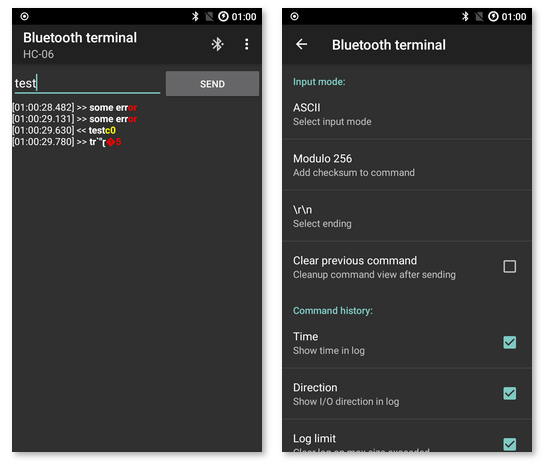

# Comunicación Bluetooth

Para activar el servicio Bluetooth y emparejar dispositivos, hay que seguir una serie de pasos.


Verificar que el servicio Bluetooth esté funcionando:

```bash
sudo service bluetooth status
```

Si el servicio no está funcionando, iniciarlo:

```bash
sudo service bluetooth start
```

Mediante la herramienta `bluetoothctl` se puede emparejar y conectar dispositivos. Iniciar la herramienta, que llevará a un nuevo prompt, similar a `[bluetooth]#`.

```bash
bluetoothctl
```
Verificar que el agente esté activado:

```bash
[bluetooth]# agent on
```

Activar el escaneo

```bash
[bluetooth]# scan on
```

Elegir  el dispositivo con el que se desea emparejar de la lista, usando `pair` seguido de la dirección MAC del dispositivo.

```bash
[bluetooth]# pair [MAC address]
``` 

Para salir del prompt de `bluetoothctl`, usar `quit`.

## Bluetooth con Python

Se puede enviar y recibir datos a través de Python usando la biblioteca `pybluez`. Para instalar el módulo:

```bash
pip install pybluez
```

Mediante el siguiente ejemplo, se espera una conexión entrante a través del protocolo RFCOMM de Bluetooth, acepta la primera conexión que se realiza y luego recibe 1024 bytes de datos del dispositivo conectado. El dispositivo tiene que estar emparejado previamente antes de poder establecer una conexión.

```python
import bluetooth

server_sock=bluetooth.BluetoothSocket(bluetooth.RFCOMM)

port = 1
server_sock.bind(("",port))
server_sock.listen(1)

client_sock,address = server_sock.accept()
print("Accepted connection from ",address)

data = client_sock.recv(1024)
print("received [%s]" % data)

client_sock.close()
server_sock.close()
```

## Bluetooth Terminal

Para interactuar con la Raspberry Pi se puede utilizar un teléfono celular con Android, y alguna app terminal como **Bluetooth terminal**. Se puede descargar desde F-Droid mediante el link [https://f-droid.org/en/packages/ru.sash0k.bluetooth_terminal/](https://f-droid.org/en/packages/ru.sash0k.bluetooth_terminal/).



## Problemas conocidos

Algunas dependencias son requeridas, instalarlas mediante el gestor de paquetes:

```bash
sudo apt install bluetooth bluez blueman
```

Al intentar instalar PyBluez puede aparecer algunos errores

```bash
Collecting PyBluez
  Using cached PyBluez-0.23.tar.gz (97 kB)
  Preparing metadata (setup.py) ... error
  error: subprocess-exited-with-error

  × python setup.py egg_info did not run successfully.
  │ exit code: 1
  ╰─> [1 lines of output]
      error in PyBluez setup command: use_2to3 is invalid.
      [end of output]

  note: This error originates from a subprocess, and is likely not a problem with pip.
error: metadata-generation-failed

× Encountered error while generating package metadata.
╰─> See above for output.

note: This is an issue with the package mentioned above, not pip.
hint: See above for details.
```

Según [este hilo en **stackoverflow**](https://stackoverflow.com/questions/75818465/pybluez-error-in-pybluez-setup-command-use-2to3-is-invalid), se puede resolverlo instalando directamente desde el repositorio oficial:

```bash
pip install git+https://github.com/pybluez/pybluez.git#egg=pybluez
```

No obstante, pueden aparecer otros problemas, que se pueden resolver instalando dependencias faltantes, según [este hilo en **StackExchange**](https://raspberrypi.stackexchange.com/questions/71216/cant-install-pybluez)

```bash
sudo apt install libbluetooth-dev
```