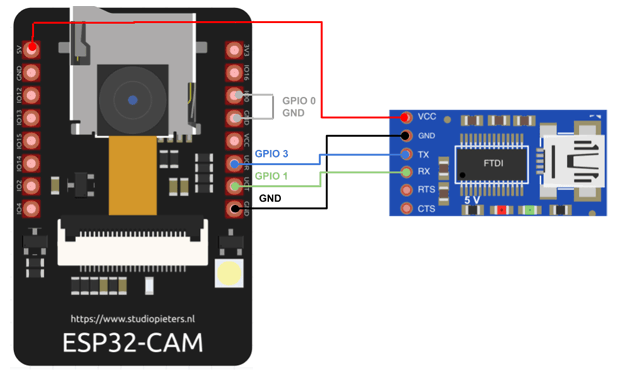
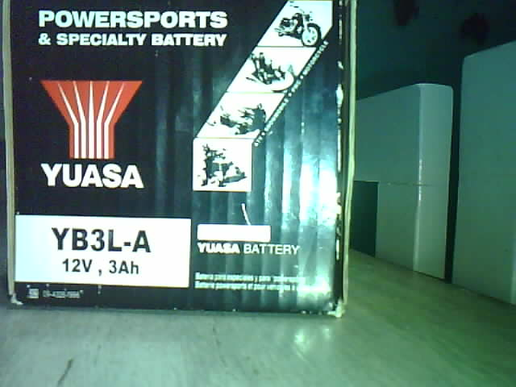

# Dispositivo con ESP32-CAM

Dispositivo base para trabajar con ESP32-CAM.

- `micropython-camera-driver` Repositorio de Mauro Riva
- `OV2640.pdf` Datasheet OV2640 Color CMOS UXGA (2.0 MegaPixel) CAMERACHIP
- `ESP32-CAM Pinout.jpg` Pinout de la placa ESP32-CAM
- `FTDI.png` Conexión adaptador USB
- `capture.py` Script para capturar una fotografía
- `process.py` Script para detectar colores

## Pinout


| GPIO      | Dispositivo               | Función               |
| --------- | ------------------------- | --------------------- |
| GPIO 0    |                           | Flashing mode = LOW   |
| GPIO 4    | LED Flash                 | LED de iluminación    |
| GPIO 33   | LED Builtin               | LED de uso general    |
|           |                           |                       |
| GPIO 1    | UART TX                   | Comunicación serie    |
| GPIO 2    | UART RX                   | Comunicación serie    |
|           |                           |                       |
| GPIO14    | SDA                       | Protocolo I2C         |
| GPIO15    | SCL                       | Protocolo I2C         |
|           |                           |                       |
| GPIO 14   | CLK                       | MicroSD               |
| GPIO 15   | CMD                       | MicroSD               |
| GPIO 2    | DATA0                     | MicroSD               |
| GPIO 4    | DATA1/FLASH               | MicroSD               |
| GPIO 12   | DATA2                     | MicroSD               |
| GPIO 13   | DATA3                     | MicroSD               |
|           |                           |                       |
| GPIO 5    | D0 Y2_GPIO_NUM            | OV2640                |
| GPIO 18   | D1 Y3_GPIO_NUM            | OV2640                |
| GPIO 19   | D2 Y4_GPIO_NUM            | OV2640                |
| GPIO 21   | D3 Y5_GPIO_NUM            | OV2640                |
| GPIO 36   | D4 Y6_GPIO_NUM            | OV2640                |
| GPIO 39   | D5 Y7_GPIO_NUM            | OV2640                |
| GPIO 34   | D6 Y8_GPIO_NUM            | OV2640                |
| GPIO 35   | D7 Y9_GPIO_NUM            | OV2640                |
| GPIO 0    | XCLK XCLK_GPIO_NUM        | OV2640                |
| GPIO 22   | PCLK PCLK_GPIO_NUM        | OV2640                |
| GPIO 25   | VSYNC VSYNC_GPIO_NUM      | OV2640                |
| GPIO 23   | HREF HREF_GPIO_NUM        | OV2640                |
| GPIO 26   | SDA SIOD_GPIO_NUM         | OV2640                |
| GPIO 27   | SCL SIOC_GPIO_NUM         | OV2640                |
| GPIO 32   | POWER PIN PWDN_GPIO_NUM   | OV2640                |

## Firmware

La placa ESP32-CAM se puede utilizar con MicroPython. Utilizaremos el driver `micropython-camera-driver` de [Mauro Riva](https://github.com/lemariva). Se puede descargar desde el repositorio en [GitHub](https://github.com/lemariva/micropython-camera-driver).

Como la placa no posee conexión USB, hay que utilizar un adaptador USB-TTL. Las conexiones son las que muestra la imagen.



Para instalarlo:

```bash
esptool.py --chip esp32 --port /dev/ttyUSB0 erase_flash
```

```bash
esptool.py --chip esp32 --port /dev/ttyUSB0 write_flash -z 0x1000 micropython_camera_feeeb5ea3_esp32_idf4_4.bin
```

## Métodos

**init**, activa e inicializa la cámara.

```python
# Formato
camera.init(0, parámetro=valor, …)
```

- `xclk_freq_hz` = `[10000000, 20000000 ]`: Frecuencia de reloj de la cámara en Hz
- `frame_size`: Tamaño de la imagen capturada
- `pixel_format` = `[JPEG, YUV422, GRAYSCALE, RGB565]`: Formato de la imagen capturada
- `jpeg_quality` = `[10..63]`: Calidad de la imagen capturada, los valores menores representan mayor calidad
- `fb_location` = `[DRAM, PSRAM]`: Ubicación de la imagen capturada, es conveniente usar PSRAM.

```python
# Ejemplo
camera.init(0, format=camera.JPEG, fb_location=camera.PSRAM)
```

**deinit**, desactiva la cámara.

```python
# Ejemplo
camera.deinit()
```

**flip**, cambia la orientación vertical de la imagen.

- `0`: Imagen normal
- `1`: Imagen invertida

```python
# Ejemplo
camera.flip(0)
```

**mirror**, cambia la orientación horizontal de la imagen.

- `0`: Imagen normal
- `1`: Imagen invertida

```python
# Ejemplo
camera.mirror(1)
```

**framesize**, especifica el tamaño y resolución de la imagen capturada.

- `FRAME_96X96` = 96*96
- `FRAME_QQVGA` = 160*120
- `FRAME_QCIF` = 176*144
- `FRAME_HQVGA` = 240*160
- `FRAME_240X240` = 240*240
- `FRAME_QVGA` = 320*240
- `FRAME_CIF` = 352*288
- `FRAME_HVGA` = 480*320
- `FRAME_VGA` = 640*480
- `FRAME_SVGA` = 800*600
- `FRAME_XGA` = 1024*768
- `FRAME_HD` = 1280*720
- `FRAME_SXGA` = 1280*1024
- `FRAME_UXGA` = 1600*1200
- `FRAME_FHD` = 1920*1080
- `FRAME_P_HD` = 2048*1152
- `FRAME_P_3MP` = 2048*1536
- `FRAME_QXGA` = 2048*1536
- `FRAME_QHD` = 2560*1440
- `FRAME_WQXGA` = 2560*1600
- `FRAME_P_FHD`
- `FRAME_QSXGA` = 2560*2048

```python
# Ejemplo
camera.framesize(camera.FRAME_CIF)
```

**quality**, especifica la calidad de la imagen capturada. Varia entre 10 (calidad alta) y 63 (calidad baja).

```python
# Ejemplo
camera.quality(10)
```

**contrast**, especifica el contraste de la imagen. Varia entre -2 (contraste bajo) y 2 (contraste alto). Por omisión vale 0.

```python
# Ejemplo
camera.contrast(1)
```

**saturation**, especifica la saturación (intensidad de los colores) de la imagen. Varia entre -2 (baja intensidad) y 2 (alta intensidad). Por omisión vale 0.

```python
# Ejemplo
camera.saturation(-1)
```

**brightness**, especifica el brillo de la imagen. Varia entre -2 (mas bajo) y 2 (mas alto). Por omisión vale 0.

```python
# Ejemplo
camera.brightness(1)
```

**speffect**, aplica un efecto a la imagen.

- `EFFECT_NONE`: sin efecto, valor por omisión
- `EFFECT_NEG`: negativo
- `EFFECT_BW`: escala de grises
- `EFFECT_RED`: rojizo
- `EFFECT_GREEN`: verdoso
- `EFFECT_BLUE`: azulado
- `EFFECT_RETRO`: sepia

```python
# Ejemplo
camera.speffect(camera.EFFECT_NONE)
```

**whitebalance**, equilibra los niveles de los colores básicos (Rojo, Verde y Azul).

- `WB_NONE`: sin compensación
- `WB_SUNNY`: compensa días soleados
- `WB_CLOUDY`: compensa días nublados
- `WB_OFFICE`: compensa iluminación fría
- `WB_HOME`: compensa iluminación cálida

```python
# Ejemplo
camera.whitebalance(camera.WB_NONE)
```

**capture**, captura una imagen.

```python
# Ejemplo
img = camera.capture()
```

## Ejemplo de captura

`capture.py` permite capturar una foto 640*480 y almacenarla en PSRAM.



## Recursos

- [Aprende a programar la ESP32-CAM en Micropython. Parte 1](https://www.profetolocka.com.ar/2022/04/18/aprende-a-programar-la-esp32-cam-en-micropython-parte-1/)
- [Aprende a programar la ESP32-CAM en Micropython. Parte 2](https://www.profetolocka.com.ar/2022/04/25/aprende-a-programar-la-esp32-cam-en-micropython-parte-2/)
- [ESP32 CAM introducción y primeros pasos](https://programarfacil.com/esp32/esp32-cam/)
- [ESP32-CAM: Machine Vision Tips, Camera Guides and Projects](https://www.arducam.com/esp32-machine-vision-learning-guide/)