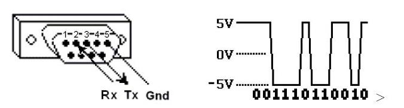
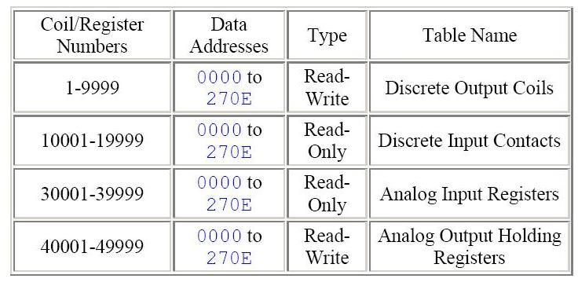
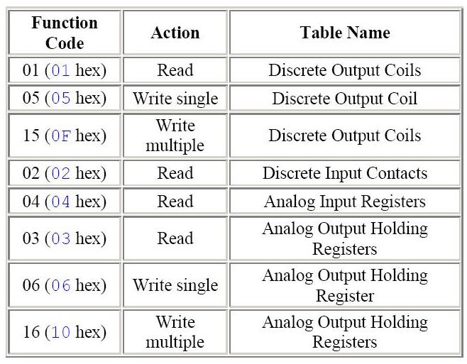
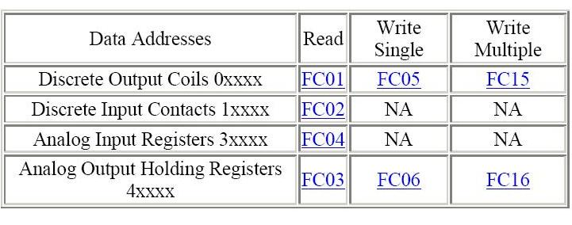
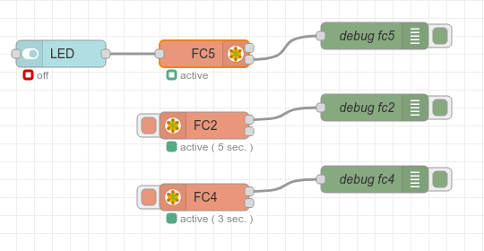

# Modbus

**Modbus** es un protocolo de comunicaciones situado en los niveles 1, 2 y 7 del Modelo OSI, basado en la arquitectura maestro/esclavo (RTU) o cliente/servidor (TCP/IP), diseñado en 1979 por Modicon para su gama de controladores lógicos programables (PLCs). Convertido en un protocolo de comunicaciones estándar de facto en la industria, es el que goza de mayor disponibilidad para la conexión de dispositivos electrónicos industriales.

## Características

Las principales razones por las cuales el uso de Modbus en el entorno industrial se ha impuesto por encima de otros protocolos de comunicaciones son:

- Se diseñó teniendo en cuenta su uso para aplicaciones industriales.

- Es público y gratuito.

- Es fácil de implementar y requiere poco desarrollo.

- Maneja bloques de datos sin suponer restricciones.

La especificación oficial de Modbus se puede encontrar en [modbus.org](http://www.modbus.org/).

Modbus permite el control de una red de dispositivos, por ejemplo un sistema de medida de temperatura y humedad, y comunicar los resultados a una computadora. Modbus también se usa para la conexión de una PC de supervisión con una unidad remota (RTU) en sistemas de supervisión adquisición de datos (SCADA). Existen versiones del protocolo Modbus para puerto serie y Ethernet (Modbus/TCP).

Cada dispositivo de la red Modbus posee una dirección única. Cualquier dispositivo puede enviar órdenes Modbus, aunque lo habitual es permitirlo sólo a un dispositivo maestro. Cada comando Modbus contiene la dirección del dispositivo destinatario de la orden. Todos los dispositivos reciben la trama pero solo el destinatario la ejecuta. Cada uno de los mensajes incluye información redundante que asegura su integridad en la recepción. Los comandos básicos Modbus permiten controlar un dispositivo RTU para modificar el valor de alguno de sus registros o bien solicitar el contenido de dichos registros.

## ¿Como funciona?

Modbus se transmite a través de líneas serie entre dispositivos. La configuración más sencilla sería un único cable serie que conecte los puertos serie de dos dispositivos, un Cliente y un Servidor.



Los datos se envían como una serie de unos y ceros llamados bits, cada bit se envía como un voltaje. Los ceros se envían como voltajes positivos y los unos como negativos.

## ¿Cómo se almacenan los datos en Modbus estándar?

La información se almacena en el dispositivo Servidor en cuatro tablas diferentes. Dos tablas almacenan valores discretos de encendido/apagado (bobinas/coils) y dos almacenan valores numéricos (registros/registers). Cada una de las bobinas y los registros tiene una tabla de solo lectura y una tabla de lectura y escritura. Cada tabla tiene 9999 valores. Cada bobina o contacto es de 1 bit y se le asigna una dirección de datos entre 0000 y 270E. Cada registro tiene 1 word = 16 bits = 2 bytes y también tiene una dirección de datos entre 0000 y 270E.



Los números de bobina/registro se pueden considerar como nombres de ubicación, ya que no aparecen en los mensajes reales. Las direcciones de datos se utilizan en los mensajes. Por ejemplo, el primer *Holding Register*, número 40001, tiene la dirección de datos 0000. La diferencia entre estos dos valores es el *offset*. Cada tabla tiene un offset diferente: 1, 10001, 30001 y 40001.

## ¿Qué es el Server ID?

A cada servidor en una red se le asigna una dirección única del 1 al 247. Cuando el cliente solicita datos, el primer byte que envía es la dirección del servidor. De esta manera, cada servidor sabe después del primer byte si ignora o no el mensaje.

## ¿Qué es un código de función?

El segundo byte enviado por el Cliente es el código de función, este número le dice al servidor a qué tabla acceder y si leer o escribir en la tabla.



## ¿Qué es un CRC?

CRC (*Cyclic Redundancy Check*) significa verificación de redundancia cíclica. Son dos bytes que se agregan al final de cada mensaje Modbus para la detección de errores. Cada byte del mensaje se utiliza para calcular el CRC. El dispositivo receptor también calcula el CRC y lo compara con el CRC del dispositivo emisor. Si incluso un bit del mensaje se recibe incorrectamente, los CRC serán diferentes y se producirá un error.

## ¿Cuáles son los formatos de los comandos y respuestas Modbus?



## ¿Cuál es el orden de bytes y words?

La especificación Modbus no define exactamente cómo se almacenan los datos en los registros. Por lo tanto, algunos fabricantes implementaron Modbus en sus equipos para almacenar y transmitir primero el byte superior seguido del inferior. Alternativamente, otros almacenan y transmiten primero el byte inferior. De manera similar, cuando los registros se combinan para representar tipos de datos de 32 bits, algunos dispositivos almacenan los 16 bits superiores (palabra alta) en el primer registro y la palabra baja restante en el segundo, mientras que otros hacen lo contrario. 

No importa en qué orden se envían los bytes o las palabras, siempre que el dispositivo receptor sepa en qué dirección esperarlo. Por ejemplo, si el número 29.235.175.522 fuera a enviarse como un entero sin signo de 32 bits, podría disponerse de cualquiera de estas cuatro formas.

- **AE41 5652** byte alto primera palabra alta primero.
- **5652 AE41** byte alto primera palabra baja primero.
- **41AE 5256** byte bajo primera palabra alta primero.
- **5256 41AE** byte bajo primera palabra baja primero.

## Implementación con Arduino

Mediante Arduino se pueden implementar tanto dispositivos maestros como esclavos. Hay varias bibliotecas disponibles para el ecosistema Arduino para trabajar con Modbus, por ejemplo [ModbusRTUSlave](https://github.com/CMB27/ModbusRTUSlave) de [Chris Bulliner](https://github.com/CMB27) implementa la lógica esclavo/servidor del protocolo Modbus RTU.

El archivo de ejemplo `ModbusRTUSlave.ino` permite trabajar con una placa Arduino MEGA y el bus.

## Implementación mediante Terminal Serie

Mediante algún programa de comunicación serie se pueden enviar y recibir tramas Modbus, diseñadas siguiendo la especificación del protocolo, o con algún software para generarlas, por ejemplo [Simply Modbus](https://simplymodbus.ca/).

Utilizando *CoolTerm* se pueden enviar comandos a un esclavo Arduino para cambiar el estado de dos bobinas:

```bash
Slave ID: 2 / 0x02
Function Code: 15 / 0x0F
Offset: 1
Registers: 1 / 0x0000
Values to Write: 2 / 0x0002
Values: BIN 11 / DEC 3 / HEX 0x0103
CRC: 0xDE83
```

```bash
Frame ON:
02 0F 00 00 00 02 01 03 DE 83
```

```bash
Frame OFF:
02 0F 00 00 00 02 01 00 9E 82
```

## Implementación con Node-RED

Mediante Node-Red se puede implementar tanto un maestro, como un esclavo utilizando el paquete [node-red-contrib-modbus](https://flows.nodered.org/node/node-red-contrib-modbus). En el archivo `modbus_flows.json` se implementan nodos para escribir y leer en un dispositivo esclavo.



## Recursos

- [Modbus en Wikipedia](https://es.m.wikipedia.org/wiki/Modbus)
- [What is Modbus and How does it work?](https://www.se.com/us/en/faqs/FA168406/)
- [Bridging Modbus Data to MQTT for IIoT: A Step-by-Step Tutorial](https://emqx.medium.com/bridging-modbus-data-to-mqtt-for-iiot-a-step-by-step-tutorial-dd1d3ae55c7f)
- [Introduction to Modbus and Raspberry PLC](https://www.industrialshields.com/es_ES/blog/raspberry-pi-para-la-industria-26/introduction-to-modbus-and-raspberry-plc-part-1-586)
- [ModbusRTUSlave](https://github.com/CMB27/ModbusRTUSlave)
- [ModbusRTUMaster](https://github.com/CMB27/ModbusRTUMaster)
- [CoolTerm](https://freeware.the-meiers.org/#CoolTerm)
- [Simply Modbus](https://simplymodbus.ca/)
- [Online CRC-8 CRC-16 CRC-32 Calculator](https://crccalc.com/)