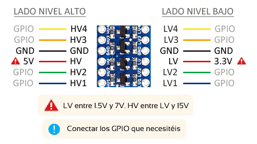

# Sensor DHT11 RS-485

Construcción de un sensor de humedad y temperatura mediante el DHT11. Utiliza comunicación cableada mediante RS-485.

- `tx_rs485.ino` Código fuente para Arduino Uno
- `RPI RS485 DHT11.fzz` Diagrama pictórico (Fritzing)
- `MAX485 Module Schematic.jpg` Diagrama esquemático módulo MAX485 comercial

## Hardware

Diagrama esquemático del módulo conversor UART<>RS-485:


Adaptador de nivel lógico (5V <> 3V3):



---

Para utilizar la comunicación serial sobre los GPIO de una Raspberry Pi 3B+ y un chip conversor UART a RS485, puedes seguir estos pasos:

1. **Habilitar la UART:** Debes habilitar la UART en la Raspberry Pi. Para ello, debes editar el archivo `/boot/config.txt` y añadir la línea `enable_uart=1`. Además, debes deshabilitar el servicio de consola serial editando el archivo `/boot/cmdline.txt` y eliminando cualquier parámetro que contenga `ttyAMA0`.

2. **Conexión física:** Deberás conectar tu chip conversor UART a RS485 a los pines GPIO de la Raspberry Pi. Los pines a utilizar son el GPIO14 (UART0_TXD) y GPIO15 (UART0_RXD).

3. **Instalación de las librerías necesarias:** Necesitarás instalar las librerías de Python que te permitirán realizar la comunicación serial. Puedes hacerlo con el siguiente comando: `pip install pyserial`.

4. **Programación de la comunicación:** Después de realizar el paso anterior, podrás escribir un script en Python para manejar la comunicación. Un ejemplo básico sería:

```python
import serial

ser = serial.Serial(
    port="/dev/ttyAMA0",  # Dispositivo de puerto serial
    baudrate=9600,  # Velocidad de transmisión
    parity=serial.PARITY_NONE,
    stopbits=serial.STOPBITS_ONE,
    bytesize=serial.EIGHTBITS,
    timeout=1,
)

while True:
    tx_data = "Hello"
    if tx_data != "":
        print("Envío: " + tx_data)
        ser.write(tx_data.encode("utf-8"))  # Envío de datos

    rx_data = ser.readline().decode("utf-8").strip()  # Recepción de datos
    if rx_data != "":
        print("Recibido: " + rx_data)
```

Por favor, verifica las especificaciones de tu dispositivo industrial para asegurarte de que los parámetros de la comunicación serial (tales como la velocidad de transmisión, paridad, bits de parada, tamaño de los bytes) sean correctos.

5. **Reinicio:** Finalmente, debes reiniciar tu Raspberry Pi para que los cambios surtan efecto.

Nota: Este proceso puede variar dependiendo del chip conversor UART a RS485 que estés utilizando. Por lo tanto, te insto a que consultes el datasheet o el manual del usuario del chip para obtener instrucciones más específicas.

-----

El chip SN75176 es un transceptor diferencial que se utiliza para implementar las comunicaciones RS485. Como mencionaste, este chip tiene un pin que selecciona si el chip está en modo de transmisión (TX) o en modo de recepción (RX).

Este pin de control de dirección se puede conectar a otro pin GPIO de la Raspberry Pi y controlar directamente desde tu código Python.

Aquí hay un ejemplo de cómo podrías hacerlo utilizando la biblioteca RPi.GPIO:

```python
import RPi.GPIO as GPIO
import time
import serial

# Define el pin de control de dirección
DIR_PIN = 4  # Reemplaza con el número de pin GPIO que estás utilizando

# Configura el pin de control de dirección como salida
GPIO.setmode(GPIO.BCM)
GPIO.setup(DIR_PIN, GPIO.OUT)

# Abre el puerto serial
ser = serial.Serial("/dev/ttyAMA0", baudrate=9600)

# Función para enviar datos
def send_data(data):
    # Cambia a modo de transmisión
    GPIO.output(DIR_PIN, True)  # True para TX
    time.sleep(0.1)  # Espera un poco para asegurarte de que el cambio de dirección se ha realizado
    ser.write(data)
    time.sleep(0.1)  # Espera un poco para asegurarte de que los datos se han enviado antes de cambiar la dirección
    # Cambia a modo de recepción
    GPIO.output(DIR_PIN, False)  # False para RX

# Ejemplo de uso
send_data(b"Hola")
```

Este script de ejemplo define una función send_data que cambia el chip al modo de transmisión, envía algunos datos, y luego cambia el chip de nuevo al modo de recepción.

Por favor, asegúrate de reemplazar `DIR_PIN` con el número de pin GPIO que estás utilizando para controlar el pin de dirección del SN75176.

Además, este código no incluye la recepción de datos. Para eso, necesitarías una función de lectura similar que se asegure de que el chip esté en modo de recepción antes de intentar leer datos.

Por último, este código asume que estás utilizando la biblioteca RPi.GPIO para controlar los pines GPIO de la Raspberry Pi. Si estás utilizando una biblioteca diferente (como gpiozero), tendrás que adaptar este código para que funcione con esa biblioteca.

------

El código para recibir datos a través del chip SN75176 utilizando la biblioteca RPi.GPIO en Python podría ser similar al siguiente:

```python
import RPi.GPIO as GPIO
import time
import serial

# Define el pin de control de dirección
DIR_PIN = 4  # Reemplaza con el número de pin GPIO que estás utilizando

# Configura el pin de control de dirección como salida
GPIO.setmode(GPIO.BCM)
GPIO.setup(DIR_PIN, GPIO.OUT)

# Abre el puerto serial
ser = serial.Serial("/dev/ttyAMA0", baudrate=9600)

# Función para recibir datos
def receive_data():
    # Asegúrate de que el chip está en modo de recepción
    GPIO.output(DIR_PIN, False)  # False para RX
    while True:
        if ser.inWaiting() > 0:
            data = ser.read(ser.inWaiting()).decode('utf-8')
            print("Datos recibidos: ", data)

# Ejemplo de uso
receive_data()
```
Este script de ejemplo define una función `receive_data` que se asegura de que el chip esté en modo de recepción y luego lee cualquier dato que llegue por el puerto serial. Los datos se imprimen en la consola a medida que se reciben.

Por favor, asegúrate de reemplazar `DIR_PIN` con el número de pin GPIO que estás utilizando para controlar el pin de dirección del SN75176.

Además, este código no incluye la transmisión de datos. Para eso, necesitarías una función de escritura similar que se asegure de que el chip esté en modo de transmisión antes de intentar enviar datos.

Por último, este código asume que estás utilizando la biblioteca RPi.GPIO para controlar los pines GPIO de la Raspberry Pi. Si estás utilizando una biblioteca diferente (como gpiozero), tendrás que adaptar este código para que funcione con esa biblioteca.
