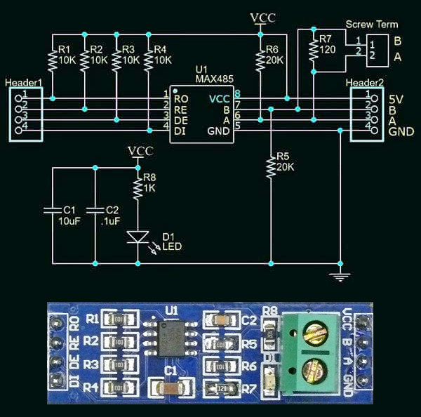

# RS-485 en la Rapsberry Pi

Se puede utilizar la comunicación serial sobre los GPIO de una Raspberry Pi 3B+. Luego, con un chip conversor UART a RS485, se puede establecer una red maestro/esclavos. Los pasos a seguir son los siguientes:

## Habilitar la UART

Editar el archivo `/boot/config.txt` y añadir la línea `enable_uart=1`. Además, deshabilitar el servicio de consola serial editando el archivo `/boot/cmdline.txt` y eliminando cualquier parámetro que contenga `ttyAMA0`. Reiniciar la Raspberry Pi.

## Conexión física

Conectar el módulo conversor UART/RS485 a los pines `GPIO14 (UART0_TXD)` y `GPIO15 (UART0_RXD)`. El circuito del módulo es el siguiente:



Hay que tener en cuenta los niveles de tensión lógicos que aceptan los pines, por lo que probablemente haya que utilizar un adaptador de nivel lógico (5V/3.3V):


## Programación

Se puede enviar y recibir datos mediante Python. Es necesario instalar la biblioteca de comunicación serial:

```bash
pip install pyserial
```

Ejemplo:

```python
import serial

ser = serial.Serial(
    port="/dev/ttyAMA0",    # Dispositivo de puerto serial
    baudrate=9600,          # Velocidad de transmisión
    parity=serial.PARITY_NONE,
    stopbits=serial.STOPBITS_ONE,
    bytesize=serial.EIGHTBITS,
    timeout=1,
)

while True:
    tx_data = "Hello"
    if tx_data != "":
        print("Envío: " + tx_data)
        ser.write(tx_data.encode("utf-8"))  # Envío de datos

    rx_data = ser.readline().decode("utf-8").strip()  # Recepción de datos
    if rx_data != "":
        print("Recibido: " + rx_data)
```

## Recursos

- [MODBUS RS485 Raspberry Pi](https://medium.com/raspberry-pi-and-rs485-modbus/modbus-rs485-raspberry-pi-5ccbc1996b7d)
- [PyModbus](https://pymodbus.readthedocs.io/en/latest/)