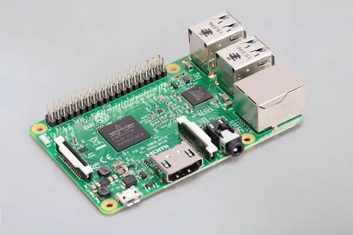

# Servidor

El servidor está basado en una placa [Raspberry Pi 3 Model B](https://www.raspberrypi.com/products/raspberry-pi-3-model-b/) y corre el sistema operativo [Raspberry Pi OS](https://www.raspberrypi.com/software/) basado en Debian GNU/Linux.



## Iniciar un Python script al bootear

Para hacer que un script se ejecute automáticamente al iniciar la Raspberry Pi, hay que agregarlo al archivo `rc.local`:

```bash
sudo nano /etc/rc.local
python3 /ruta/al/script.py &
sudo reboot
```

En caso de utilizar `systemd` en lugar de `rc.local` para ejecutar tu script al iniciar el sistema en una Raspberry Pi, hay que crear un servicio systemd:

1. Crear un archivo de servicio para el script. Por ejemplo, crear un archivo `miprograma.service` en `/etc/systemd/system/`:

```bash
sudo nano /etc/systemd/system/miprograma.service
```

2. Definir el servicio:

```
[Unit]
Description=Mi programa
After=multi-user.target

[Service]
Type=simple
ExecStart=/usr/bin/python3 /ruta/a/tu/script.py
Restart=always

[Install]
WantedBy=multi-user.target
```

3. Recargar la configuración de systemd para que reconozca el nuevo servicio:

```bash
sudo systemctl daemon-reload
```

4. Habilitar el servicio para que se inicie automáticamente en el arranque:

```bash
sudo systemctl enable miprograma.service
```

5. Iniciar el servicio:

```bash
sudo systemctl start miprograma.service
```
