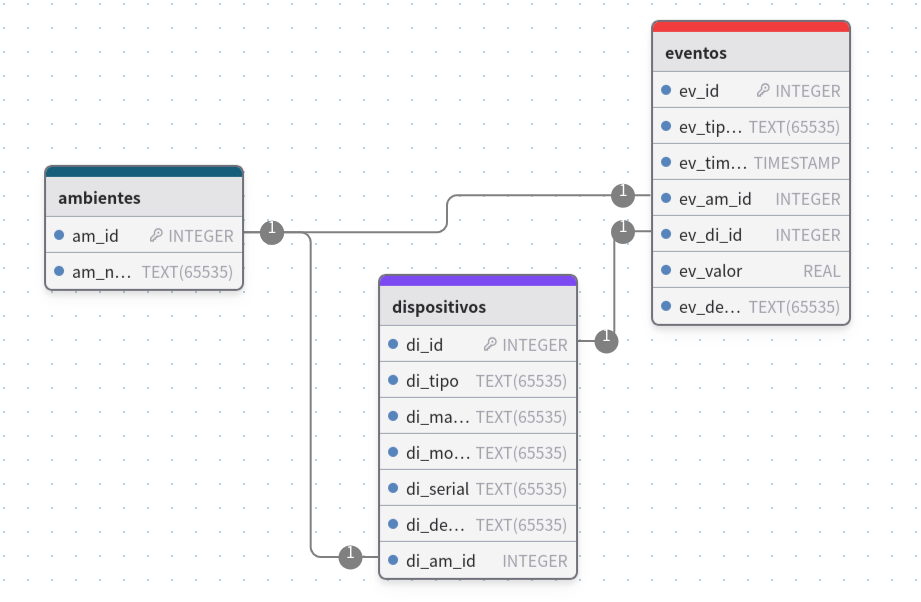

# SQLite

*SQLite* es una biblioteca en lenguaje C que implementa un motor de base de datos SQL pequeño, rápido, autónomo, de alta confiabilidad y con todas las funciones. SQLite es el motor de base de datos más utilizado en el mundo, está integrado en todos los teléfonos móviles y la mayoría de las computadoras y viene incluido en innumerables otras aplicaciones que las personas usan todos los días.

El formato de archivo SQLite es estable, multiplataforma y compatible con versiones anteriores y los desarrolladores se comprometen a mantenerlo así hasta el año 2050. Los archivos de base de datos SQLite se utilizan comúnmente como contenedores para transferir contenido enriquecido entre sistemas y como un formato de archivo a largo plazo para datos. El código fuente de SQLite es de dominio público y es gratuito para que todos lo usen para cualquier propósito.

## Diseñar una base de datos para domótica

Los requisitos elementales para montar un pequeño servidor de domótica son los siguientes:

- *Dispositivos:* son unicos, dependiendo el tipo reciben o devuelven un valor float o boolean, poseen marca, modelo y número de serie, estan ubicados en algún ambiente en particular y generan eventos.

- *Eventos:* asociados tanto a sensores como actuadores. Tienen que describir la ocurrencia del evento (causa, timestamp, etc.).

- *Ambientes:* lugares físicos donde se instalarán los diversos sensores y actuadores.

Por lo tanto, deberemos tener cuatro tablas relacionadas:

- Ambientes: almacena información sobre los distintos ambientes del hogar.
- Dispositivos: almacena información sobre los sensores y actuadores.
- Eventos: registra los eventos generados por sensores y actuadores.

## Diseño de tablas con drawDB



## Consultas SQL (CREATE)

```sql
CREATE TABLE IF NOT EXISTS "ambientes" (
	"am_id" INTEGER NOT NULL UNIQUE,
	"am_nombre" TEXT NOT NULL,
	PRIMARY KEY("am_id")	
);
```

```sql
CREATE TABLE IF NOT EXISTS "dispositivos" (
	"di_id" INTEGER NOT NULL UNIQUE,
	"di_tipo" TEXT NOT NULL CHECK(di_tipo IN ('sensor', 'actuador')),
	"di_marca" TEXT NOT NULL,
	"di_modelo" TEXT NOT NULL,
	"di_serial" TEXT NOT NULL UNIQUE,
	"di_descripcion" TEXT,
	"di_am_id" INTEGER,
	PRIMARY KEY("di_id"),
	FOREIGN KEY ("di_am_id") REFERENCES "ambientes"("am_id")
	ON UPDATE NO ACTION ON DELETE NO ACTION
);
```

```sql
CREATE TABLE IF NOT EXISTS "eventos" (
	"ev_id" INTEGER NOT NULL UNIQUE,
	"ev_tipo_evento" TEXT NOT NULL,
	"ev_timestamp" TIMESTAMP DEFAULT CURRENT_TIMESTAMP,
	"ev_am_id" INTEGER,
	"ev_di_id" INTEGER,
	"ev_valor" REAL,
	"ev_descripcion" TEXT,
	PRIMARY KEY("ev_id"),
	FOREIGN KEY ("ev_am_id") REFERENCES "ambientes"("am_id")
	ON UPDATE NO ACTION ON DELETE NO ACTION
);
```

## Consultas SQL (INSERT)

Insertar ambientes:

```sql
INSERT INTO ambientes (am_nombre) VALUES ('Habitación');
INSERT INTO ambientes (am_nombre) VALUES ('Cocina');
```

Insertar dispositivos:

```sql
INSERT INTO dispositivos (di_tipo, di_marca, di_modelo, di_serial, di_descripcion, di_am_id) VALUES
('actuador', 'Sonoff', 'Basic R2', '21-5387', 'Relé interruptor WiFi', 2),
('sensor', 'Analog Devices', 'DS18B20', '19-7487', 'Sensor de temperatura ambiente', 2);
```

Insertar eventos:

```sql
INSERT INTO eventos (ev_tipo_evento, ev_am_id, ev_di_id, ev_valor, ev_descripcion) VALUES
('Cambio de temperatura', 2, 1, 23.0, 'La temperatura subió a 23.0°C'),
('Actuador activado', 2, 2, 1, 'El actuador fue activado');
```

## Recursos

- [SQLite](https://www.sqlite.org/)
- [DB Browser for SQLite](https://sqlitebrowser.org/)
- [drawDB](https://www.drawdb.app/)
- [SQLite with Node-RED and Raspberry Pi](https://randomnerdtutorials.com/sqlite-with-node-red-and-raspberry-pi/)